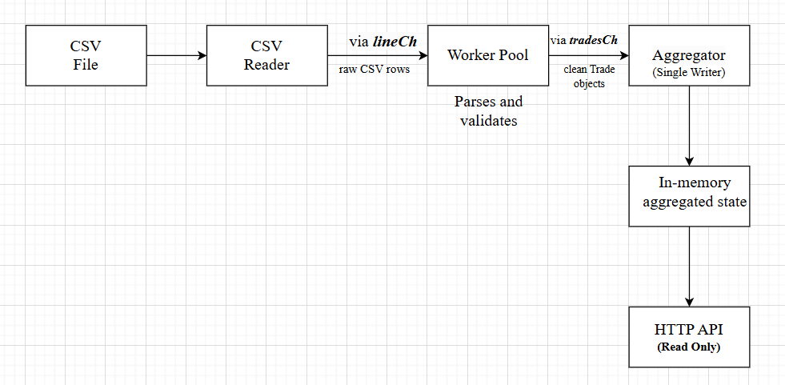

## Overview
This back-end service ingests a large CSV file(here ***ticks.csv***) of trade events and computes market analytics incrementally while at the same time,  keeping memory usage bounded. I designed it as a streaming pipeline using Go’s concurrency and stores only aggregated state.

## Data Flow

* The CSV reader reads the input file line by line and sends raw CSV records to a channel.
* A worker pool parses and validates these records concurrently, converting valid rows into **Trade** objects.
* A single aggregator goroutine consumes parsed trades and updates all aggregated analytics.
* The HTTP API layer exposes read-only access to the aggregated data.

***At no point are raw trades stored in memory***

## Concurrency Approach

I used the concurrency approach using the follwoing goroutines and channels:

* The CSV reader runs in a **single** goroutine to ensure safe, sequential file I/O.
* **Multiple** worker goroutines parse and validate CSV rows in parallel.
* Only **one** goroutine is allowed to update shared aggregation state (single-writer pattern).
* **HTTP handlers** may read aggregated state concurrently and are protected using an **RWMutex**.

This design helped me avoid data races while allowing parallel processing of CPU-bound parsing work(csv parsing).

## Duplicate Handling

The input data did have duplicate trades.

A deduplication strategy that I thought of is:

* For each symbol, the last processed trade is tracked.

* If a new trade is identical to the previously seen trade for that symbol (same timestamp, price, and quantity), it is ignored.

This approach removes ***common consecutive duplicates*** while keeping the memory usage bounded. Non-consecutive duplicates may still be processed and this is as a trade-off I can see.

**Why I chose this?**
Because, it takes $O(1)$ memory cost per symbol and hence is extremely fast. Also, no cleanup needed.

## Handling Out-of-Order Data

Trades are not guaranteed to arrive in timestamp order.

To handle this:

* Each trade is bucketed into a 1-minute time window based on its timestamp.
* OHLC candles track the earliest (Open) and latest (Close) timestamps seen within each bucket.
* Open and Close values are updated by comparing timestamps rather than relying on arrival order.

This ensures correct OHLC computation even when data arrives out of order.

## Memory Behavior

The service never stores raw trade data.

Only the following aggregated state is kept in memory:

* OHLC candles per (symbol × minute)
* Running VWAP totals per symbol
* Last-seen trade per symbol (for deduplication)

Memory usage grows with the number of symbols and time buckets observed, not with the number of trades in the input file.

## Trade-offs and Assumptions

* Deduplication is intentionally limited to consecutive duplicates to avoid unbounded memory growth.
* OHLC candles are retained for all observed time buckets during ingestion; since the assignment processes a finite CSV file, this keeps memory usage bounded within scope.
* In a production system, older candles would typically be evicted or persisted externally.
* All timestamps are processed in UTC, which avoids timezone-related inconsistencies.

## How to run

After cloning this repo, inorder to run this service:

**go run cmd/server/main.go**

On startup, the service will:
* Begin ingesting the CSV file
* Start an HTTP server on port 8080

## Available Endpoints

Once the service is running, the following endpoints are available:

* Health check   
curl http://localhost:8080/health

* List all symbols   
curl http://localhost:8080/symbols

* Get OHLC candles for a symbol   
curl http://localhost:8080/ohlc?symbol=RELIANCE

* Get VWAP for a symbol   
curl http://localhost:8080/vwap?symbol=TCS

All responses are returned in JSON format.

## Graceful Shutdown

Press **Ctrl+C** to stop the service.

The server will:

* Stop accepting new HTTP requests
* Finish processing any in-flight requests
* Shut down cleanly